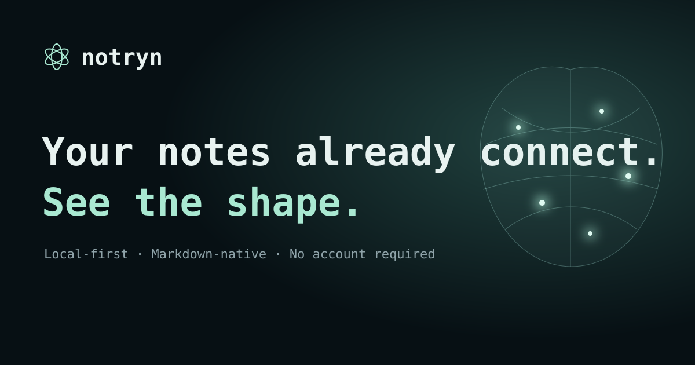

<p align="center">
  
</p>

<p align="center">
  <strong>A local-first Markdown workspace for writing, organizing and seeing how your notes connect.</strong>
</p>

<p align="center">
  <a href="site/index.html">Landing draft</a> ·
  <a href="https://github.com/pedromst/notryn/releases/tag/v0.2.0-alpha.2">Private alpha download</a> ·
  <a href="CONTRIBUTING.md">Contributing</a> ·
  <a href="SECURITY.md">Security</a> ·
  <a href="docs/PUBLIC-RELEASE-CHECKLIST.md">Release checklist</a>
</p>

# NOTRYN

Open a folder you already use or create a new Brain. Your files stay yours, in an open format.

NOTRYN works locally without a login. Files remain ordinary Markdown, so you can use other editors or agents alongside it. An AI connection is not required to read, write or organize your notes.

Preview 0.2 is in development. The platform is in English and adapts to desktop and mobile screens. Your note content and the names of your files, folders and Brains stay in their original language.

> **Private development preview.** The repository is being prepared for a public, community-reviewed release. The code license and contributor terms have not been finalized, so this repository does not currently grant permission to copy, distribute or sell the software.

## Private alpha installation

Private self-contained desktop packages are available for Intel macOS and x86_64 Linux, including Omarchy. They open Notryn in its own application window, install only for the current user, require no Python runtime on the destination computer, expose the private server only on `127.0.0.1`, and preserve Brains independently from application updates or removal.

See [Private alpha installation](docs/PRIVATE-ALPHA.md) for the exact verified download, install, terminal and uninstall commands. Public distribution remains disabled while signing, licensing and release review are unfinished.

The actual installable files are hosted in the [private GitHub Release](https://github.com/pedromst/notryn/releases/tag/v0.2.0-alpha.2), rather than inside the source tree.

## Get started

Requires Python 3.10 or later. No external Python dependencies, account, API key or cloud service is required.

```sh
python3 server.py
```

On Windows, use `py -3 server.py`. Open [NOTRYN locally](http://127.0.0.1:4783).

The landing page is also private during development. Preview it locally with:

```sh
python3 -m http.server 4794 --bind 127.0.0.1 --directory site
```

Then open [the local landing draft](http://127.0.0.1:4794/).
On macOS, you can also use `Open NOTRYN.command`.
On Linux, run `./start.sh` to start NOTRYN and open your default browser. The launcher works from any working directory, requires no desktop installation and accepts server options such as `--port 4790`. Stop the server with Ctrl C. If file permissions were lost when copying it, use `sh start.sh`.

A fresh installation starts with no Brains. Choose **Create a Brain** or **Open a folder**. For an existing folder, paste its path or click the folder icon to browse Home, Desktop, Documents and other locations on the computer running the server. Connect multiple Brains and switch between them using the top picker.

The folder picker supports search by name, arrow-key navigation, Enter or → to open a subfolder, ← to go to its parent, and Tab to reach **Use this folder**, followed by Enter. Esc cancels without changing the form. Choosing a folder fills its path and, when empty, the Brain name; **Open folder** then connects it. Pasted paths accept surrounding quotes, escaped spaces on macOS/Linux and local file URLs.

Existing folders connect as **Read-only** by default. Choose **Read and write** when connecting a folder to edit its files. A protected folder cannot be made writable by reconnecting it through a parent or child folder.

Open the Brain name in the top bar, or press **B**, to reach **Your Brains**. **Create a Brain** and **Open a folder** are the first actions in this space. Every connected Brain has an **Access** control that can change it between Read-only and Read and write later. Enabling writing shows the exact folder and confirms that Notryn may create, edit, move and remove Markdown files there. This changes only Notryn's permission setting; no file is changed until the user performs a separate file action. Temporary shared previews remain read-only and explain that Brain management is available in the local app.

## Your workspace

- Library with drag-and-drop notes/folders, contextual creation, filtering and recent notes.
- Remove notes, folders or Brains from Notryn while keeping their files, with optional recoverable Trash and a searchable Removed items space.
- Visual note writing with selection-based formatting, an optional Markdown view, preview and explicit saving.
- Note on the left by default, a saved preference for swapping sides, and a full-width focus mode.
- Searchable command palette and a keyboard reference with clickable actions.
- Connections from `[[note-name]]` links and Markdown links to `.md` files.
- A glass brain with translucent hemispheres, layered filaments, luminous notes and pulses along real note connections.
- Each opened folder lists its direct subfolders and Markdown filenames, matching the files on disk. The Brain uses the same filenames; opening a note keeps sibling dots and labels visible. Dense layers use compact, non-overlapping labels where space permits.
- Search covers every indexed note, regardless of the open folder. It matches words in filenames, paths and document titles across spaces, hyphens and accents, with exact filenames first. Search results are no longer capped at 30; the reader retains the original document title.
- Quiet glass panels, a full-width immersive brain mode, optional motion and keyboard zoom.
- Iris on a floating glass surface, with a large voice circle, conversation and writing below. English speech when a local voice is available. Local commands, search, excerpts and drafts; no generative AI model is connected yet.
- Mobile navigation for the brain, notes, creation and Iris.

Shortcuts use the same letters on macOS, Windows and Linux. They work outside text fields. While writing, press **Esc** first to leave the field without closing or changing the note, then use an action. **P → search an action → Enter** reaches every command; **?** searches the keyboard reference. Frequent actions also have direct keys. In a dialog, Tab/Shift Tab move between controls, arrows navigate choices and Enter confirms. No letter shortcut runs while you type.

| Action | Key |
| --- | --- |
| Notes and commands | P |
| Commands and shortcuts | ? |
| Show / hide brain (keep the open note) | H |
| Show full Brain and clear filters | Shift H |
| Choose theme | T |
| Show / hide interface hints | Shift T |
| Swap note and brain | Shift L |
| Focus note / exit focus | F |
| Immersive brain / return | Shift G |
| Toggle Iris | A |
| Toggle Iris voice | Shift A |
| Create a Brain | Shift B |
| Switch Brain | B |
| Open an existing folder | O |
| New folder | Shift N |
| New note | N |
| Move the focused note or folder | M |
| Open its actions menu | Shift M |
| Show the open note in its computer folder | Shift O |
| Review removal of the focused note or folder | D |
| Removed items: restore or remove an entry | Shift D, then Tab to the action and Enter |
| Preview note | V |
| Switch pane | W / Shift W |
| Save | S |
| Edit / finish editing | E |
| Save and return to reading | Shift S |
| Switch Write / Markdown | Shift E |
| Open formatting controls | Shift F |
| Toggle library | L |
| Filter notes | Q |
| All notes: clear filters, keep the draft | Shift Q |
| Choose a category | C, arrows, Enter; Home selects All |
| Refresh notes | R |
| Recent notes | Shift R |
| Close panel / leave field | Esc |

Swapping panes preserves unsaved text, the cursor and the reading position. Esc inside a text field leaves it while keeping the draft; outside fields it leaves focus mode or closes the current panel, asking before discarding unsaved writing. On mobile, the note already uses the full width and the layout controls are hidden.

Global NOTRYN commands do not bind Ctrl, Cmd, Alt, AltGr or Super combinations, or function keys. Browser and window-manager commands keep their native bindings outside the editor. Inside an editable note, **Ctrl/Cmd+S saves without leaving writing** and **Ctrl/Cmd+Enter toggles Preview**. The Save button and Shift S save and return to reading; Done returns when there are no changes. A failed save or newer unsaved edits keep the editor open. No autosave is enabled. Ctrl/Cmd plus scrolling keeps browser zoom; ordinary scrolling over the brain zooms the brain. Tab and Shift Tab keep native focus navigation, including in Markdown.

Tab/Shift Tab follow the visible control order, including buttons on mobile WebKit. Modal dialogs keep focus inside; at workspace edges, browser navigation remains available. Escape closes a search dialog even when its search field contains text, while respecting any operation that temporarily blocks cancellation.

Inside Write mode, standard text shortcuts are scoped to the editable field:

| Action | Key |
| --- | --- |
| Bold / italic | Ctrl/Cmd B / I |
| Insert or edit a link | Ctrl/Cmd K |
| Strikethrough | Ctrl/Cmd Shift X |
| Undo / redo | Ctrl/Cmd Z / Shift Z (also Ctrl/Cmd Y for redo) |
| Copy / cut / paste / select all | Ctrl/Cmd C / X / V / A (native) |
| Line break | Shift Enter |

For headings, lists, quotes and code: select text, then **Esc → P → action name → Enter**. Selection stays in the visual editor while the palette has focus. The same actions appear in **?** under Formatting. **Esc → Shift F** opens the compact formatting toolbar; use Tab, arrows and Enter there. These formatting commands require Write mode; Markdown remains a plain text editor.

Open **Commands and shortcuts** and turn off **Single-key shortcuts** if they overlap with your keyboard extensions or assistive tools. The choice is saved in this browser. Buttons, the palette, Tab/Enter and arrow navigation remain available. You can always reach the keyboard icon with Tab to re-enable shortcuts. Custom browser, extension or desktop configurations may reserve additional keys.

### Brain and library without a mouse

Use **Shift H** to show the complete Brain, close the note and center the view; unsaved writing asks for a decision first. **H** only shows/hides the Brain and keeps your draft. **All** at the beginning of the categories, or **Shift Q**, clears filters without closing the note. **C** focuses the category choices, arrows move between them and Enter applies one; Home followed by Enter returns to All. **0** only centers the camera and resets zoom.

Press **G** outside text fields to focus the brain. While it has focus:

| Action | Key |
| --- | --- |
| Rotate / tilt | Arrow keys |
| Zoom in / out | + (or =) / − |
| Center and reset zoom | 0 |
| Pause / resume motion | Space |
| Next / previous note | J / K, or Page Down / Page Up |
| Open the highlighted note | Enter |
| Leave brain controls | Tab or W |

Use **Shift G** outside text fields, or **Immersive brain / return** in the command palette, to hide the library and note pane without closing your draft. **Esc** restores the previous layout and writing focus. Opening a note from the immersive brain brings its pane back. On mobile, this command opens the brain view.

Selecting a note gives its label a solid theme accent. Directly connected notes use a softer shade of the same color; other labels and folder colors remain visible. Selected connections carry up to three brighter travelling points per line, with a bounded particle count for dense Brains.

Pausing freezes rotation, pulses and ambient effects. The pause preference is saved in the browser, and reduced-motion preferences are respected. Automatic rotation is suspended while the brain has focus to make selection easier. J/K navigation respects the current filter and orders notes alphabetically.

In the library, ↑/↓ move between rows, ←/→ collapse or expand folders, Home/End move to the first/last row, and Enter opens a note. After filtering with Q, use ↓ or Enter to reach the results. The Brain picker also supports arrows and Enter. Forms use Tab, Shift Tab and Enter; confirm a selection with Enter before moving on with Tab.

W cycles through visible panes and Shift W reverses direction outside text fields. Esc first leaves an input; Tab moves forward and Shift Tab backward through controls. Arrow keys in text fields retain selection behavior. Global commands ignore modifiers and IME composition; the editor handles only its documented save, preview and formatting combinations. Selecting text in the reader also suppresses global letter commands.

All actions remain in the P command palette, including actions without a dedicated key. Type an action name, navigate with arrows and press Enter. Typed characters in the palette, theme picker and forms are handled locally and do not trigger workspace commands.

Less frequent flows share that same route: **Manage Brain access**, **Remove this Brain from Notryn**, **Expand all folders**, **Collapse all folders**, **Read an excerpt of this note**, **Start a draft**, and **Configure keyboard shortcuts**. Permissions, restoration and removal still require choosing an item and confirming in their dialogs with Tab/Enter. Open the folder browser with **O**, Tab to **Browse folders**, Enter; arrows/Enter browse directories and Tab reaches **Choose folder**. The Brain picker uses the same **Shift B** and **O** bindings as the workspace. Themes use T, arrows and Enter; Iris uses A, type the request, Enter.

### Organizing files

Drag a note onto a folder to move it. Drag a folder onto another folder to move its entire contents, including subfolders and attachments. Drop onto **Brain root** above the library to return an item to the top level. A highlighted folder shows the drop destination; open a collapsed folder first to reach its children.

For keyboard or touch, use the item's **⋯** menu and **Move to…**. With a library row focused, **M** opens the same destination picker: type to filter folders, use ↑/↓ to choose and **Enter** to move. **Esc** cancels. The command palette and **?** reference include the move action. The menu also has **New note here** and **New folder here**; N/Shift N default to the focused folder or the current note's folder.

Save an open draft before moving files. The open note follows its new path and revision. A move cannot replace an existing item, leave the current Brain, place a folder inside itself or its descendants, or change a read-only Brain. Folders containing symbolic links or app data cannot be moved through this feature.

Ordinary wiki links, Markdown inline/reference links and local attachment links are updated when their resolved targets change location. Labels, anchors, titles and unrelated source bytes are retained. Frontmatter, code examples, comments and custom HTML/plugin syntax are not rewritten. Relative Markdown links resolve from the containing note. Moves save recovery manifests and copies of changed notes under the private state's `backups/` directory and restore the original location if a link update fails. A process or disk interruption can require manual recovery from those copies. The link update limit is 2,000 notes of at most 1 MB each.

### Removing and restoring

Choose **Remove from Notryn…** in a note or folder's **⋯** menu, or press **D** with its library row focused. The command palette also includes **Remove this Brain from Notryn**. Each Brain in the top picker has a removal button.

The default **Remove from Notryn** keeps every file on the device. A note or folder disappears from this installation's library, searches and Brain view; a whole Brain is disconnected. These choices live in Notryn's private state, so other applications and the original Markdown files are unaffected. Read-only Brains support this default operation too.

The review shows the affected location. The separate **Also move files to Notryn Trash** checkbox starts unchecked. Select it to move the item, including a folder's contents and attachments, out of its original location into recoverable storage. Removing an entire Brain this way also requires typing its exact name. Notryn Trash is managed by the app, not the operating system's Trash, and does not permanently erase files or free their disk space. Read-only, protected and overlapping Brain folders cannot be moved to Trash.

Open **Removed items** from the library's trash icon, the Brain picker or the command palette. Search, use ↑/↓ to reach **Restore**, and press **Enter** to bring an item back. Restore its Brain and parent folder first if they were also removed. Restoration never overwrites a file already at the original location; resolve that conflict before retrying. Save any open draft before removing or restoring items.

Removed records survive restarts. Preserve the private state and recovery storage until everything you need is restored. On the same filesystem, Trash is under the private state's `trash/` directory; another filesystem uses a hidden `.notryn-trash/` beside the Brain, or inside its root when needed. Each recovery slot includes its original location. There is no permanent-delete or Empty Trash action in this preview.

### Write naturally

**Write** is the default editing view. Select text to open the nearby formatting bar, or use **Format** for keyboard access. Choose Text, Heading 1–6, Quote or Code block; apply bold, italic, strikethrough, bullet/numbered lists and links. Enter continues a list; an empty item followed by Enter returns to normal writing. Undo and redo are also available in the bar. Tab retains normal focus movement.

The text-style menu keeps the selected range and stays in place until a choice is applied. Selected text uses the theme's accent background with contrasting black or white lettering in reading, writing and input fields.

**Add a link** accepts a web address or lets you search and choose another note, without typing paths. Note links are saved as `[[target|text]]`, so the Brain shows their connections after saving. External links and note links work in the reader.

Use **Markdown** for direct source editing. Switching views does not save automatically. **Save** is explicit and retains the existing revision/conflict and backup protections. Frontmatter and unchanged blocks keep their source. Tables, task lists, callouts, HTML and other unsupported extensions remain preserved blocks; use Markdown to change those blocks. The reader displays simple tables. Images stay as inert placeholders, and embedded HTML is never executed. The editor does not send note content to another service.

Open Iris with **A** outside text fields. Its central line stays still when idle and becomes a wave during local speech. The wave illustrates speech state, rather than measured audio amplitude; there is no microphone input. The voice button enables or stops speech. Reduced-motion preferences keep the line still with a visible speaking status. All five themes and Omarchy colors apply to this surface; on shorter screens the circle moves beside the conversation to keep writing accessible. Closing and reopening Iris preserves your unsent question.

### Ask Iris

Try `Find my project`, `Read this note`, `Show connections` or `Create a draft about a new idea`. Iris searches note names and paths, reads excerpts and opens a draft for you to write. It does not generate summaries or write content autonomously.

Speech is off by default. When enabled, it uses a local English browser voice or Samantha on macOS, if installed. No voice is downloaded automatically. Quoted note content is read as written, without translation.

### Appearance and Omarchy

Use the appearance icon or **T** outside text fields. While writing, press **Esc**, then **T**. **↑/↓** choose a theme, **Enter** applies it and **Esc** cancels. Home/End jump to the first/last option; typing a theme name selects it. The command palette and shortcut reference include **Choose theme**. Your preference is saved in this browser, including after restarting NOTRYN. Changing themes preserves unsaved writing, the cursor, scroll and brain position.

| Theme | Atmosphere |
| --- | --- |
| Glass | Deep blue space, translucent surfaces and mint light |
| Daylight | Frosted white glass and calm green ink |
| Matrix | Dark phosphor green with soft neural light |
| Command | Amber signals, precise panels and a subtle spatial grid |
| Dusk | Warm dark surfaces and rose light |
| Follow Omarchy | Live colors from the local Linux desktop |

Iris also understands `Switch to Matrix`, `Use light theme`, `Change theme to Dusk`, `Follow Omarchy` and `Show themes`. These are local commands; no AI connection is required.

Omarchy does not automatically color arbitrary web applications. NOTRYN includes a read-only bridge to its active `colors.toml`, covering the newer `~/.local/state/omarchy/current/theme/` location and the older `~/.config/omarchy/current/theme/` location. XDG state/config locations and legacy theme symlinks are also supported. Light mode is read from `mode = "light"` or the older `light.mode` marker. Background, foreground, accent and palette colors style both the interface and the brain, with text adjusted for legibility.

On a first visit, an available Omarchy palette is selected automatically. Choosing a NOTRYN preset stops following the desktop; choose **Follow Omarchy** to resume. The app checks about every two seconds while visible and following. No reload, theme hook, desktop configuration edit or extension is needed. If Omarchy is not detected, follow mode uses Glass and waits for a palette; a server connection failure keeps the last colors. The colors come from the computer running the local server.

The bridge follows the [Omarchy theme configuration](https://github.com/omacom/omarchy/blob/quattro/manual/43-making-your-own-theme.md) and [active-theme staging paths](https://github.com/omacom/omarchy/blob/quattro/bin/omarchy-theme-set). Legacy/new-path fixtures and a live dark-to-light palette change have been tested locally. The private Linux package has also been installed and opened successfully in a native Omarchy session; a broader palette-switching review there is still pending.

## Files and protection

Private installation state lives in `.notryn/`, which is excluded from Git:

- `brains.json`: Brain names, paths, permissions and removal/recovery records.
- `brains/`: Brains created in this installation.
- `backups/`: the previous version of each note changed by NOTRYN.
- `trash/`: recoverable files explicitly moved out of their original location.

To use another location, run `python3 server.py --data-dir /path/to/state` or set `NOTRYN_HOME`. Existing Neura installations keep reading `NEURA_HOME` and a legacy `.neura/` directory, so the rename does not disconnect Brains or recovery data. Existing folders stay in their original location. Back up your Brains and private state before moving or replacing the installation.

Saving checks the file revision to reject concurrent changes, keeps the previous version and replaces the file atomically. Creating a note never overwrites an existing file. Removal defaults to keeping files on the device; the optional Trash action and restoration use recoverable moves and reject stale reviews or destination conflicts.

The folder browser lists directories only, without connecting them or modifying files. It searches one level at a time, hides dot folders and paginates large lists. Folder browsing requires the same local origin and session token as other local actions, and is unavailable through the read-only preview gateway. A connected folder with no Markdown files is valid and appears with no notes.

The server listens only on `127.0.0.1`. Writes require the local origin and the session token. Notes are not sent to AI models. Fonts are served locally.

## Temporary mobile access

The interface adapts to mobile screens, but the local server is not automatically accessible over the network. The optional `python3 share.py --minutes 120` script requires `cloudflared` in PATH and opens a private, temporary, **read-only** preview. Run it only when you want to share access; the complete link is a credential. Stop it with Ctrl C. Access expires automatically at the end of the requested period.

The tunnel transports content through Cloudflare. The mobile editor has been checked in a 390 × 844 browser viewport; writing from a physical phone and native mobile folder integration still need development.

## Preview limitations

The index includes up to 2,000 notes of up to 1 MB each. It skips hidden files, symbolic links and tool folders. The reader supports common Markdown elements; it does not execute HTML, plugins or embedded queries. Connections are explicit, without semantic inference. The glass cortex and its fine filaments are illustrative. Bright nodes represent your notes, and traveling pulses follow their explicit links.

This preview does not include synchronization, a native app, an installer, a generative agent or full Obsidian plugin compatibility. macOS has been checked; Windows and Linux still need native validation.

## Development

```sh
python3 -m unittest discover -s tests -v
npm ci
npm test
```

Python tests use temporary folders and cover saving, moves, removal/restore, conflicts, backups, read-only Brains, path isolation and HTTP request validation. Removal tests include file preservation, nested folders, attachments, interrupted operations, persistence failures and restoration collisions. The Node.js keyboard tests check the actual command catalog against system modifiers, browser keys, text entry, IME, selected text, disabled preferences and canvas scope. They do not test writes in personal folders connected to the installation.

Iris tests cover speech lifecycle, cancellation races, reduced motion and suspension of animation in hidden panels or background tabs. Speech mocks do not play audio.

The visual editor is bundled locally using [ProseMirror](https://github.com/ProseMirror/prosemirror-markdown). Running NOTRYN still needs only Python and a browser. Contributors need Node.js to rebuild it with `npm ci` and `npm run build:editor`; the browser uses `web/vendor/editor.js` without a CDN. Dependency licenses are bundled in `web/vendor/EDITOR-LICENSES.txt`. Editor tests also cover exact source preservation, protected blocks, Markdown round trips and unsafe links.

Before a future release, include only code, documentation, tests and visual assets. Never publish `.notryn/`, legacy `.neura/`, Brains, backups or sharing credentials. Public distribution and a code license have not been finalized. See the [public release checklist](docs/PUBLIC-RELEASE-CHECKLIST.md), [contribution guide](CONTRIBUTING.md) and [security policy](SECURITY.md).

Typography: JetBrains Mono, the default base family used by [Omarchy](https://learn.omacom.io/2/the-omarchy-manual), bundled with its [OFL license](web/fonts/OFL-JetBrainsMono.txt). Icons are SVG and do not depend on Nerd Font glyphs.

Keyboard conflict references: [Chrome](https://support.google.com/chrome/answer/157179?hl=en), [Firefox](https://support.mozilla.org/en-US/kb/keyboard-shortcuts-perform-firefox-tasks-quickly), [Safari](https://support.apple.com/guide/safari/keyboard-shortcuts-and-gestures-cpsh003/mac) and [Omarchy](https://github.com/omacom/omarchy/blob/quattro/manual/07-hotkeys.md). The packaged app now has an initial native Omarchy smoke test; full shortcut coverage across supported systems remains pending.
