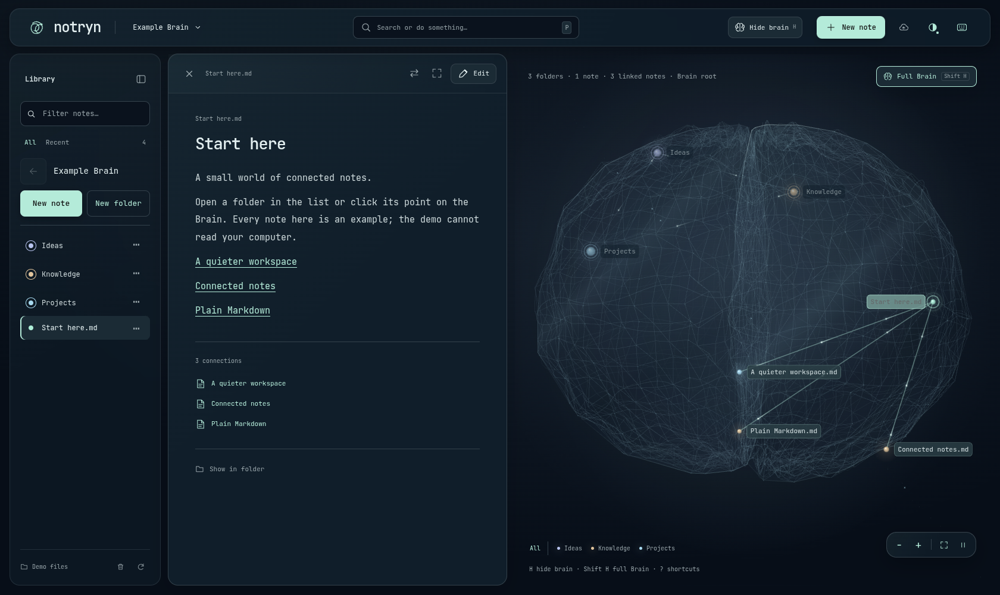

<p align="center"></p>
<h1 align="center">Notryn</h1>
<p align="center">One second brain for all your AI tools.</p>
<p align="center">Your notes stay on your computer, in files you own. Switch AI tools whenever you like without losing your context, and never depend on just one.</p>
<p align="center">The Brain is a visual map: every note is a dot, and linked notes are joined by lines.</p>

<p align="center">
  <a href="https://github.com/pedromst/notryn/releases"></a>
  <a href="LICENSE"></a>
  <a href="#install"></a>
  <a href="https://notryn.com"></a>
</p>

A local Markdown app for notes and projects. Use your mouse or keyboard. The files stay in folders you control, so other editors can open them, and the AI tools you allow can read them. Notryn does not include an AI model and does not connect to one for you.

**Public beta. The local app is free, and source-available under PolyForm Shield.** No account or cloud subscription is required to use it. [Try the demo](https://notryn.com/#experience) · [Installation guide](https://notryn.com/guide.html)

<p align="center"></p>

## Install

Linux first, then macOS. The installer detects your computer, downloads the matching desktop app, verifies its checksum and creates the launcher. Python and Node.js are bundled; you do not need to install them to run Notryn.

| Platform | Package |
| --- | --- |
| Linux x86_64, including Omarchy | `.tar.gz` archive, installed for your user |
| macOS Intel | Desktop app in `~/Applications` |
| macOS Apple silicon | Native ARM64 package |
| Windows | Not available yet |
| iOS / Android | Mobile version in development, no date yet |

Run as your normal user, after saving and quitting an older Notryn:

```sh
curl -fsSL https://notryn.com/install.sh | sh
```

If the domain is unavailable, use the same versioned installer directly from GitHub:

```sh
curl -fsSL https://github.com/pedromst/notryn/releases/download/v0.2.0-beta.13/install.sh | sh
```

The installer opens the desktop app when finished. **macOS packages are experimental: ad-hoc signed, not Apple-notarized.** macOS may block them; do not disable Gatekeeper. Linux requires an x86_64 graphical system with Electron's standard system libraries. The published Linux download is `Notryn-<version>-linux-x86_64.tar.gz` (for the current beta, `Notryn-0.2.0-beta.13-linux-x86_64.tar.gz`). It is not a standalone AppImage file. The installer checks that archive, unpacks it for your user, and starts the desktop app without requiring FUSE. Omarchy has been tested; not every distribution is verified.

[Full installation guide](docs/INSTALL.md) · [Release notes](docs/RELEASE-NOTES.md) · [Downloads](https://github.com/pedromst/notryn/releases/tag/v0.2.0-beta.13)

## What you can do

- Write visually or in Markdown, with explicit saving, conflict protection and editable note links.
- Choose exactly where every new Brain folder is created and see its full path before confirming.
- Navigate your actual folders and see connections in an interactive Brain.
- Rename or move notes and folders while Notryn updates their resolved links.
- Use the mouse, direct shortcuts or a searchable command menu.
- Keep a personal notebook or project context in plain Markdown files.
- Work locally, without a Notryn account, cloud subscription or connected AI model.

[Workspace and keyboard guide](docs/USAGE.md)

## Use the same Brain on all your computers

GitHub Sync keeps your Brain the same on several computers, through a private GitHub repository you own. Free during the beta. Later, sync may become an optional paid feature at a low price, with a one-time option. The app itself stays free.

You turn sync on for each Brain. Notryn has no server that stores your notes. Each sync records changes in that Brain folder, downloads changes from the repository you chose, merges them, and sends the result back. It can run when Notryn opens, on a schedule from 5 to 60 minutes, or when you choose Sync now. If two computers change the same note, Notryn keeps the copy on this computer and saves the other next to it. It does not write Git conflict markers into your notes.

[How sync works](docs/SYNC.md) · [Setup help](https://notryn.com/sync.html) · [Maintainer notes](docs/PAYMENTS.md)

## License

Copyright 2026 Pedro Teixeira. [PolyForm Shield 1.0.0](LICENSE) permits free use for allowed purposes, including use within businesses, and restricts competing products. This is source-available, not an OSI open-source license. Third-party components retain their [own licenses](THIRD_PARTY_NOTICES.md). [Contribution terms](CONTRIBUTOR-AGREEMENT.md).

## Everyday commands

| Task | Command |
| --- | --- |
| Open the desktop app | `notryn` |
| Check the installed version | `notryn version` |
| Update after saving and quitting the app | `notryn update` |
| Return to the previous application version | `notryn rollback` |
| Uninstall, keeping notes and settings | `notryn uninstall` |

If your shell cannot find `notryn`, use `~/.local/bin/notryn` or add `~/.local/bin` to your PATH. The installer does not edit your shell profile.

Updating downloads the package first and checks its integrity and local server before replacing the app. A failed replacement restores the previous app. Notes and settings stay separate. Rollback changes the application only; it is not a note backup.

## Your files stay yours

Connected folders stay where you put them. The application, settings and Brains are separate:

| System | Application | Settings and recovery data |
| --- | --- | --- |
| Linux | `~/.local/lib/notryn` | `$XDG_DATA_HOME/notryn`, normally `~/.local/share/notryn` |
| macOS | `~/Applications/Notryn.app` | `~/Library/Application Support/Notryn` |

New Brains are stored in the location you choose. Brains created by older versions remain in their existing private-state location. The local server listens only on `127.0.0.1`. Nothing is automatically uploaded to an AI model. Notes leave your computer only if you turn on GitHub Sync for a Brain, and then only to the GitHub repository you choose. Uninstalling keeps your data and retains recoverable application backups. Back up your own folders and private state independently.

## Current limits

The public beta is still being tested. macOS public signing/notarization and Windows packaging remain pending. There is no Notryn cloud or built-in generative model. [GitHub Sync](docs/SYNC.md) needs Git 2.31+ and your own private GitHub repository. Markdown plugins and HTML execution are not included. The index currently has safety limits of 2,000 notes and 1 MB per note.

Downloads are hosted on GitHub Releases. Your app runs on your computer and does not depend on the developer's Mac. No install telemetry is collected; GitHub package download counts do not measure unique users or completed installations.

## Development and project

```sh
python3 server.py
```

Open `http://127.0.0.1:4783`. Source development requires Python 3.10+. To rebuild the editor or run checks:

```sh
npm ci
npm test
python3 -m unittest discover -s tests -v
```

[Distribution and trust model](docs/DISTRIBUTION.md) · [Contributing](CONTRIBUTING.md) · [Security](SECURITY.md) · [Public release checklist](docs/PUBLIC-RELEASE-CHECKLIST.md)
